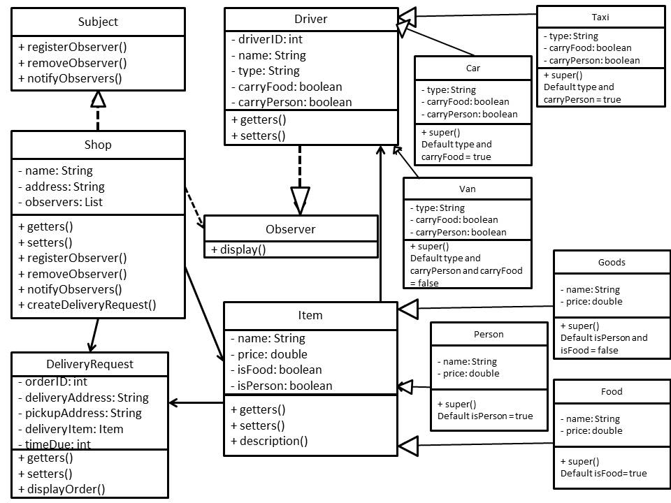

# CS 665 Assignment 2

### Marcus Andrew Acord-Serventi

### Assumptions

Assignment asked us to create a delivery notification system. Shop class, driver class, and delivery request. Then create tests to send out to the drivers for a delivery request. Then assign that item to a driver to deliver.

No main method or GUI - all testing to be run through JUnit and codeassist.

### Implementation details

I really tried to fix my mistakes from assignment 1 with the tight coupling. 

- Driver abstract class (an observer) has subclasses for vans, taxis and cars.
- Item abstract class has subclasses for people, food, or goods.

Most of the code is built around the delivery request or the shop class. The design pattern used is the observer pattern.

The shop class is the subject, and it can register, remove, or notify observers when a new request is made. The shop can also create new delivery requests.

The delivery request contains all the details needed to fulfill a delivery (orderID, item description, pickup address, dropoff address, and when the item is due to be dropped off).

This was all tested in the TestDelivery class and works fine - items, drivers, and a test shop are created, and when a delivery request is created, observers are notified.

A rough implementation of how assigning an item to a vehicle is included in the TestDelivery class - if this were an actual, real-world delivery system, this method would need to be revisited and redone. What's important for the assignment is the notification of observers.

### UML

### Assignment Questions

1. Flexibility - Code should be more flexible that assignment 1. Creating a new type of driver or item should be as simple as creating a new subclass to extend the item class.
2. Simplicity - The code grew pretty complex - I think the system is very complex for such a simple assignment. Code base includes abstract methods, interfaces, subclasses, delivery object, and more.
3. Duplicated code - Used interfaces and abstract classes to avoid duplicating code.
4. Assignment called for using the observer design pattern. Observer (one to many notification relationship) to notify the drivers of a new delivery request was obvious.

Checked the code through CodeAssist and it compiled, passed the tests, and passed the bug finder.
