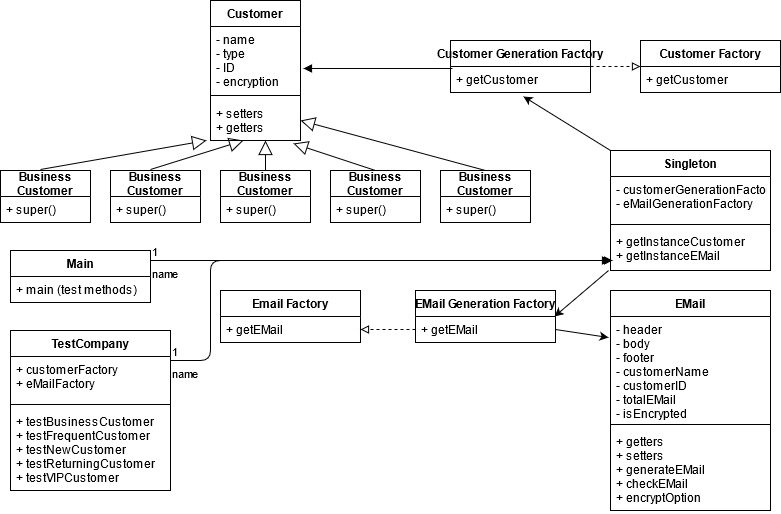

# CS 665 Assignment 3

### Marcus Andrew Acord-Serventi

### Assumptions

Assignment asked us to create a system to generate emails. A few customer types, such as business, new, returning, etc. Emails generated need to vary based on what type of customer it is.

Once emails are generated, there needs to be a way to encrypt emails to certain customers and a way to double check emails.

Only one instance of the email generation system should be created.

Assignment details do NOT specify to only use JUnit tests or not have a main method(!). Since the assignment does not specify, we assume main method is allowed.

### Implementation details

Started by creating our various customer classes. Customer abstract class, with subclasses for VIP, returning customers, etc. We do this in a customer generation factory. We are going to use two design patterns for this: factory, to generate our customers and the customer types and singleton, so we only generate one single EMailGeneration factory.

Then we created our EMailGeneration factory. The EMailGeneration factory allows us to create custom emails, based on what type of customer is passed to it. It creates a custom email with a header, body, and footer, the customer's name and ID, and a default encryption option. Custom EMail class stores all this information. Custom EMail class also contains methods to double check the EMail for accuracy (or allow custom replacement) and a method to change the encryption option for the EMail.

Created a test company class to run unit tests. We created one single CustomerGeneration factory and one EMailGeneration factory for the class (using our factory and singleton patterns!). Then we tested out each customer type and emails. Some types allow encrypted and some do not (based on when it was built in the factory).

Since we are allowed to create a main method, created a main method to test out whether our checkEmail() method works. We cannot test this check in JUnit, since JUnit is read only and does not allow for user input (which is needed to test if an email is correctly generated). This allows the main method to check the email to ensure it is okay, based on user input. We also test the custom encryption option in the main method.

### UML

### Assignment Questions

1. Flexibility - Code is somewhat flexible - new customer types can be created in the future as subclasses of the customer abstract class. These would need to be added to the customer and email generation factories as well, which is painful. If there are new ad-hoc requirements to be added, the code can be updated easily, or a decorator pattern may be used. If a new customer type is added, it must be added to the customer factory and the email factory (although the email factory does have an else statement to generate a default customer type)
2. Simplicity - The code grew pretty complex - I think the system is very complex for such a simple assignment.
3. Duplicated code - Very little duplicated code. Most duplicated code in the factory pattern else if statements.
4. Assignment called for using two design patterns. First we used the factory pattern to actually create customers of various types. Then we used the singleton pattern to ensure we only create one instance of EMailGeneration.

Checked the code through CodeAssist and it compiled, passed the tests, and passed the bug finder.

This is the CodeAssist System.
Here is CodeAssist Feedback about your implementation.
User=andrew-acordserventi
Assignment=Assignment-3
Feedback=build
Course=cs665
Programming Language=Java
Repository Name is git@github.com:metcs/met-cs665-Assignment-3-andrew-acordserventi.git

Cloned your repository and run the following Maven command:
timeout 60 mvn clean compile

[INFO] Scanning for projects...
[INFO]
[INFO] ------------------< edu.bu.cs665:JavaProjectTemplate >------------------
[INFO] Building JavaProjectTemplate 1.0-SNAPSHOT
[INFO] --------------------------------[ jar ]---------------------------------
[INFO]
[INFO] --- maven-clean-plugin:2.5:clean (default-clean) @ JavaProjectTemplate ---
[INFO]
[INFO] --- maven-resources-plugin:2.6:resources (default-resources) @ JavaProjectTemplate ---
[INFO] Using 'UTF-8' encoding to copy filtered resources.
[INFO] skip non existing resourceDirectory /var/www/cgi-bin/sessions/met-cs665-Assignment-3-andrew-acordserventi/src/main/resources
[INFO]
[INFO] --- maven-compiler-plugin:3.1:compile (default-compile) @ JavaProjectTemplate ---
[INFO] Changes detected - recompiling the module!
[INFO] Compiling 12 source files to /var/www/cgi-bin/sessions/met-cs665-Assignment-3-andrew-acordserventi/target/classes
[INFO] ------------------------------------------------------------------------
[INFO] BUILD SUCCESS
[INFO] ------------------------------------------------------------------------
[INFO] Total time: 1.198 s
[INFO] Finished at: 2021-07-26T15:26:15-04:00
[INFO] ------------------------------------------------------------------------

This is the CodeAssist System.
Here is CodeAssist Feedback about your implementation.
User=andrew-acordserventi
Assignment=Assignment-3
Feedback=tests
Course=cs665
Programming Language=Java
Repository Name is git@github.com:metcs/met-cs665-Assignment-3-andrew-acordserventi.git

Cloned your repository and run the following Maven command:
timeout 60 mvn clean compile test -Dlog4j.configuration="file:log4j.properties"

[INFO] Scanning for projects...
[INFO]
[INFO] ------------------< edu.bu.cs665:JavaProjectTemplate >------------------
[INFO] Building JavaProjectTemplate 1.0-SNAPSHOT
[INFO] --------------------------------[ jar ]---------------------------------
[INFO]
[INFO] --- maven-clean-plugin:2.5:clean (default-clean) @ JavaProjectTemplate ---
[INFO]
[INFO] --- maven-resources-plugin:2.6:resources (default-resources) @ JavaProjectTemplate ---
[INFO] Using 'UTF-8' encoding to copy filtered resources.
[INFO] skip non existing resourceDirectory /var/www/cgi-bin/sessions/met-cs665-Assignment-3-andrew-acordserventi/src/main/resources
[INFO]
[INFO] --- maven-compiler-plugin:3.1:compile (default-compile) @ JavaProjectTemplate ---
[INFO] Changes detected - recompiling the module!
[INFO] Compiling 12 source files to /var/www/cgi-bin/sessions/met-cs665-Assignment-3-andrew-acordserventi/target/classes
[INFO]
[INFO] --- maven-resources-plugin:2.6:resources (default-resources) @ JavaProjectTemplate ---
[INFO] Using 'UTF-8' encoding to copy filtered resources.
[INFO] skip non existing resourceDirectory /var/www/cgi-bin/sessions/met-cs665-Assignment-3-andrew-acordserventi/src/main/resources
[INFO]
[INFO] --- maven-compiler-plugin:3.1:compile (default-compile) @ JavaProjectTemplate ---
[INFO] Nothing to compile - all classes are up to date
[INFO]
[INFO] --- maven-resources-plugin:2.6:testResources (default-testResources) @ JavaProjectTemplate ---
[INFO] Using 'UTF-8' encoding to copy filtered resources.
[INFO] skip non existing resourceDirectory /var/www/cgi-bin/sessions/met-cs665-Assignment-3-andrew-acordserventi/src/test/resources
[INFO]
[INFO] --- maven-compiler-plugin:3.1:testCompile (default-testCompile) @ JavaProjectTemplate ---
[INFO] Changes detected - recompiling the module!
[INFO] Compiling 2 source files to /var/www/cgi-bin/sessions/met-cs665-Assignment-3-andrew-acordserventi/target/test-classes
[INFO]
[INFO] --- maven-surefire-plugin:2.12.4:test (default-test) @ JavaProjectTemplate ---
[INFO] Surefire report directory: /var/www/cgi-bin/sessions/met-cs665-Assignment-3-andrew-acordserventi/target/surefire-reports

---

## T E S T S

Running edu.bu.met.cs665.TestCompany
This is the header for a business customer!

Dear Mary, Customer # 2:

This is the body for a business customer!

This is the footer for a business customer!
This is the header for a new customer!

Dear Newbie, Customer # 3:

This is the body for a new customer!

This is the footer for a new customer!
This is the header for a business customer!

Dear Bob, Customer # 1:

This is the body for a business customer!

This is the footer for a business customer!
This is the header for a returning customer!

Dear Returner, Customer # 4:

This is the body for a returning customer!

This is the footer for a returning customer!
This is the header for a VIP customer!

Dear Special, Customer # 5:

This is the body for a VIP customer!

This is the footer for a VIP customer!
Tests run: 5, Failures: 0, Errors: 0, Skipped: 0, Time elapsed: 0.042 sec

Results :

Tests run: 5, Failures: 0, Errors: 0, Skipped: 0

[INFO] ------------------------------------------------------------------------
[INFO] BUILD SUCCESS
[INFO] ------------------------------------------------------------------------
[INFO] Total time: 1.691 s
[INFO] Finished at: 2021-07-26T15:26:55-04:00
[INFO] ------------------------------------------------------------------------

This is the CodeAssist System.
Here is CodeAssist Feedback about your implementation.
User=andrew-acordserventi
Assignment=Assignment-3
Feedback=spotbugs
Course=cs665
Programming Language=Java
Repository Name is git@github.com:metcs/met-cs665-Assignment-3-andrew-acordserventi.git

Cloned your repository and run the following Maven command:
timeout 60 mvn clean compile spotbugs:check

[INFO] Scanning for projects...
[INFO]
[INFO] ------------------< edu.bu.cs665:JavaProjectTemplate >------------------
[INFO] Building JavaProjectTemplate 1.0-SNAPSHOT
[INFO] --------------------------------[ jar ]---------------------------------
[INFO]
[INFO] --- maven-clean-plugin:2.5:clean (default-clean) @ JavaProjectTemplate ---
[INFO]
[INFO] --- maven-resources-plugin:2.6:resources (default-resources) @ JavaProjectTemplate ---
[INFO] Using 'UTF-8' encoding to copy filtered resources.
[INFO] skip non existing resourceDirectory /var/www/cgi-bin/sessions/met-cs665-Assignment-3-andrew-acordserventi/src/main/resources
[INFO]
[INFO] --- maven-compiler-plugin:3.1:compile (default-compile) @ JavaProjectTemplate ---
[INFO] Changes detected - recompiling the module!
[INFO] Compiling 12 source files to /var/www/cgi-bin/sessions/met-cs665-Assignment-3-andrew-acordserventi/target/classes
[INFO]
[INFO] >>> spotbugs-maven-plugin:4.1.3:check (default-cli) > :spotbugs @ JavaProjectTemplate >>>
[INFO]
[INFO] --- spotbugs-maven-plugin:4.1.3:spotbugs (spotbugs) @ JavaProjectTemplate ---
[INFO] Fork Value is true
[INFO] Done SpotBugs Analysis....
[INFO]
[INFO] <<< spotbugs-maven-plugin:4.1.3:check (default-cli) < :spotbugs @ JavaProjectTemplate <<<
[INFO]
[INFO]
[INFO] --- spotbugs-maven-plugin:4.1.3:check (default-cli) @ JavaProjectTemplate ---
[INFO] BugInstance size is 0
[INFO] Error size is 0
[INFO] No errors/warnings found
[INFO] ------------------------------------------------------------------------
[INFO] BUILD SUCCESS
[INFO] ------------------------------------------------------------------------
[INFO] Total time: 5.758 s
[INFO] Finished at: 2021-07-26T15:27:15-04:00
[INFO] ------------------------------------------------------------------------
