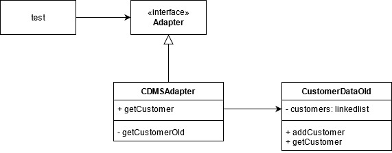
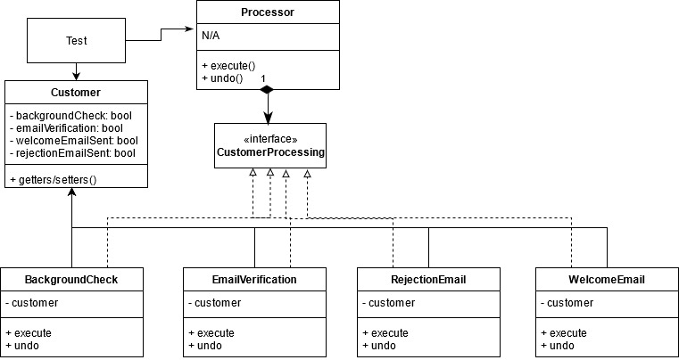
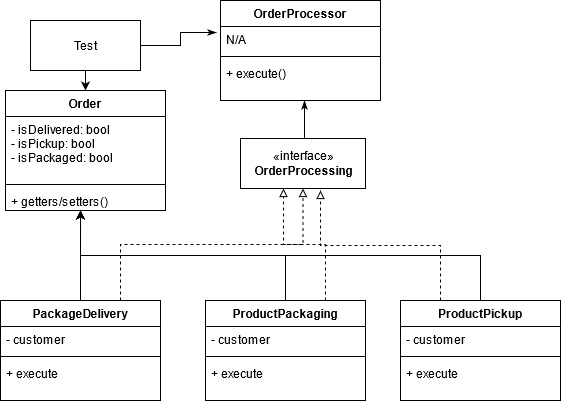

# CS 665 Assignment 4

### Marcus Andrew Acord-Serventi

### Summary

One of the most complex projects of code I've done at BU to date. Great learning experience here and tons of different ways to do this (strategy pattern w/ decorator should work, command pattern, template pattern, etc., could all work to find the results). Difficult, but mostly time consuming to lay the groundwork for the actual implementation of the design patterns.

### Assumptions

Assignment asked us to perform 3 seperate (but somewhat related) tasks. All tasks should use a design pattern (or two). Main unit or JUnit testing is allowed. I will split them up into tasks 1, 2, and 3, for sake of ease and reference.

1. Adapter pattern - New system is being created. Its not complete. The old database still needs to be used, while the new database is being created, but they want the new database to have a different client interface. To getCustomer data, you used to need to provide an email and it would return the customer. New database system requires an email AND a phone number. I don't have the database, new system, or old system, so I need to create a "mini" mockup system to test (this was HUGELY painful). Adapter pattern works here.

2. Command pattern - Multiple steps, such as email verification, background check, etc. for customer data processing. Company needs to use some of these steps, and needs the flexibility to add/remove steps. Command pattern works here - change the steps or executions into objects, and presto, problem solved. Used https://www.tutorialspoint.com/design_pattern/command_pattern.htm to help understand how to implement the Command pattern.

3. Facade pattern - Few different steps to deliver a package. We want a uniform interface to access these steps and we want to farm out the interface that can be modified to clients. Facade will let us use an easy interface to access the various components. The system is complex, but we can design a simple mockup system to allow us to test.

### Implementation details

1. Started by creating the Customer class. Our database is going to hold customers, so customers are a logical class to hold. Then made the CustomerDataOld class - this class will represent our "old database"; it essentially holds a linkedlist of customers and the getCustomer method that takes 1 parameter. Then made the adapter interface as a blueprint. Then made the CDMSAdapter class, which specifically adapts our getCustomer method to take 2 parameters and still return the correct customer. Lastly, made the getCustomer method protected so CDMSAdapter can access the database, but our test class cannot.

Tested by creating the database, filling it with 3 customers, then trying to use adapter.getCustomer and passing it 1 and 2 parameters. 2 parameters works. 1 parameter produces an error. Adapter pattern working as intended!

2. Processor is the invoker. It allows us to link to our CustomerProcessing interface and then down into subclasses to execute commands. CustomerProcessing is the blueprint interface for undo() and execute() for each command. It allows the link to our invoker to work. The subclasses (backgroundCheck, emailVerification, etc.) are the actual commands to be used. They know how to execute their commands or undo them; they are linked to the customer class, in that they can set the attributes in the customer class or undo them. In the real-world, they would actually perform the task (such as sending out an email, etc.) before updating the variable for the customer. This all allows us to say Processor p = new Processor; p.execute(new backgroundCheck(customer1)), which will perform a background check on customer1 and flag the customer as "true" (as in we have done the background check on customer1). This allows us to meet the specifications of the assignment.

3. Similar to the above. We have orders we want to process. We have an OrderProcessor to actually process the orders that links into the OrderProcessing interface and down to the actual subtasks. This is similar to the above, but one of the key differences is that we cannot undo the task. The trick here is that we want to create an easy to use interface for the client. Our code allows us to execute similar to the above, so OrderProcessor O = new OrderProcessor(); O.execute(new ProductPickup(order1)); O.execute(new ProductPackaging(order1)), etc. We simply build the tasks (and subtasks) and access them through the OrderProcessor. Facade and Command look the same almost, but (per the professor in lecture) Command supports undo functions. Since we are not supporting an undo function and we could assume that our processes built are more complex and have subprocesses (not built in our demo), I would consider this to be facade (although it appears to be Command).

### UML

Since this is essentially three problems in one, I split it into three seperate UML diagrams for sake of ease and understanding.

1. 
2. 
3. 

### Assignment Questions

1. Flexibility - I think that I gave up some flexibility by using a few choices. For instance, implementing a new command in the command pattern is seemingly easy, but it requires a new class, changes in the Customer code (to track the task completion), etc. I think the flexibility is as good as I could make it.
2. Simplicity - Not simple. At all. Complex, all around. I encountered numerous bugs that had to be ironed out (the absolute worst was a static vs non-static bug that took me 1-2 hours to iron out, solely for one minor bug). There are still things in the code that I would like to fix (like calling new BackgroundCheck when I want to execute a background check, I don't want the new). For a seasoned pro, maybe this is easy to understand - I've tried to comment where appropriate to make it easy to understand, but I think the complexity of the assignment and of my implementation is massive.
3. Duplicated code - Duplicated code is very little - the most is duplicating creation of a Customer or Order (could have used a factory pattern, but it was only for testing purposes). Most of the other duplicated code comes from stuff like the execute() and undo() methods, but these methods have to be duplicated in each subclass command in order to work.
4. Patterns used - Adapter, Command, Facade.

Checked the code through CodeAssist and it compiled, passed the tests, and passed the bug finder.

User=andrew-acordserventi
Assignment=Assignment-4
Feedback=build
Course=cs665
Programming Language=Java
Repository Name is git@github.com:metcs/met-cs665-Assignment-4-andrew-acordserventi.git

Cloned your repository and run the following Maven command:
timeout 60 mvn clean compile

[INFO] Scanning for projects...
[INFO]
[INFO] ------------------< edu.bu.cs665:JavaProjectTemplate >------------------
[INFO] Building JavaProjectTemplate 1.0-SNAPSHOT
[INFO] --------------------------------[ jar ]---------------------------------
[INFO]
[INFO] --- maven-clean-plugin:2.5:clean (default-clean) @ JavaProjectTemplate ---
[INFO]
[INFO] --- maven-resources-plugin:2.6:resources (default-resources) @ JavaProjectTemplate ---
[INFO] Using 'UTF-8' encoding to copy filtered resources.
[INFO] skip non existing resourceDirectory /var/www/cgi-bin/sessions/met-cs665-Assignment-4-andrew-acordserventi/src/main/resources
[INFO]
[INFO] --- maven-compiler-plugin:3.1:compile (default-compile) @ JavaProjectTemplate ---
[INFO] Changes detected - recompiling the module!
[INFO] Compiling 16 source files to /var/www/cgi-bin/sessions/met-cs665-Assignment-4-andrew-acordserventi/target/classes
[INFO] ------------------------------------------------------------------------
[INFO] BUILD SUCCESS
[INFO] ------------------------------------------------------------------------
[INFO] Total time: 1.250 s
[INFO] Finished at: 2021-08-01T16:12:46-04:00
[INFO] ------------------------------------------------------------------------

User=andrew-acordserventi
Assignment=Assignment-4
Feedback=tests
Course=cs665
Programming Language=Java
Repository Name is git@github.com:metcs/met-cs665-Assignment-4-andrew-acordserventi.git

Cloned your repository and run the following Maven command:
timeout 60 mvn clean compile test -Dlog4j.configuration="file:log4j.properties"

[INFO] Scanning for projects...
[INFO]
[INFO] ------------------< edu.bu.cs665:JavaProjectTemplate >------------------
[INFO] Building JavaProjectTemplate 1.0-SNAPSHOT
[INFO] --------------------------------[ jar ]---------------------------------
[INFO]
[INFO] --- maven-clean-plugin:2.5:clean (default-clean) @ JavaProjectTemplate ---
[INFO]
[INFO] --- maven-resources-plugin:2.6:resources (default-resources) @ JavaProjectTemplate ---
[INFO] Using 'UTF-8' encoding to copy filtered resources.
[INFO] skip non existing resourceDirectory /var/www/cgi-bin/sessions/met-cs665-Assignment-4-andrew-acordserventi/src/main/resources
[INFO]
[INFO] --- maven-compiler-plugin:3.1:compile (default-compile) @ JavaProjectTemplate ---
[INFO] Changes detected - recompiling the module!
[INFO] Compiling 16 source files to /var/www/cgi-bin/sessions/met-cs665-Assignment-4-andrew-acordserventi/target/classes
[INFO]
[INFO] --- maven-resources-plugin:2.6:resources (default-resources) @ JavaProjectTemplate ---
[INFO] Using 'UTF-8' encoding to copy filtered resources.
[INFO] skip non existing resourceDirectory /var/www/cgi-bin/sessions/met-cs665-Assignment-4-andrew-acordserventi/src/main/resources
[INFO]
[INFO] --- maven-compiler-plugin:3.1:compile (default-compile) @ JavaProjectTemplate ---
[INFO] Nothing to compile - all classes are up to date
[INFO]
[INFO] --- maven-resources-plugin:2.6:testResources (default-testResources) @ JavaProjectTemplate ---
[INFO] Using 'UTF-8' encoding to copy filtered resources.
[INFO] skip non existing resourceDirectory /var/www/cgi-bin/sessions/met-cs665-Assignment-4-andrew-acordserventi/src/test/resources
[INFO]
[INFO] --- maven-compiler-plugin:3.1:testCompile (default-testCompile) @ JavaProjectTemplate ---
[INFO] Changes detected - recompiling the module!
[INFO] Compiling 1 source file to /var/www/cgi-bin/sessions/met-cs665-Assignment-4-andrew-acordserventi/target/test-classes
[INFO]
[INFO] --- maven-surefire-plugin:2.12.4:test (default-test) @ JavaProjectTemplate ---
[INFO] ------------------------------------------------------------------------
[INFO] BUILD SUCCESS
[INFO] ------------------------------------------------------------------------
[INFO] Total time: 1.368 s
[INFO] Finished at: 2021-08-01T16:13:16-04:00
[INFO] ------------------------------------------------------------------------

User=andrew-acordserventi
Assignment=Assignment-4
Feedback=spotbugs
Course=cs665
Programming Language=Java
Repository Name is git@github.com:metcs/met-cs665-Assignment-4-andrew-acordserventi.git

Cloned your repository and run the following Maven command:
timeout 60 mvn clean compile spotbugs:check

[INFO] Scanning for projects...
[INFO]
[INFO] ------------------< edu.bu.cs665:JavaProjectTemplate >------------------
[INFO] Building JavaProjectTemplate 1.0-SNAPSHOT
[INFO] --------------------------------[ jar ]---------------------------------
[INFO]
[INFO] --- maven-clean-plugin:2.5:clean (default-clean) @ JavaProjectTemplate ---
[INFO]
[INFO] --- maven-resources-plugin:2.6:resources (default-resources) @ JavaProjectTemplate ---
[INFO] Using 'UTF-8' encoding to copy filtered resources.
[INFO] skip non existing resourceDirectory /var/www/cgi-bin/sessions/met-cs665-Assignment-4-andrew-acordserventi/src/main/resources
[INFO]
[INFO] --- maven-compiler-plugin:3.1:compile (default-compile) @ JavaProjectTemplate ---
[INFO] Changes detected - recompiling the module!
[INFO] Compiling 16 source files to /var/www/cgi-bin/sessions/met-cs665-Assignment-4-andrew-acordserventi/target/classes
[INFO]
[INFO] >>> spotbugs-maven-plugin:4.1.3:check (default-cli) > :spotbugs @ JavaProjectTemplate >>>
[INFO]
[INFO] --- spotbugs-maven-plugin:4.1.3:spotbugs (spotbugs) @ JavaProjectTemplate ---
[INFO] Fork Value is true
[INFO] Done SpotBugs Analysis....
[INFO]
[INFO] <<< spotbugs-maven-plugin:4.1.3:check (default-cli) < :spotbugs @ JavaProjectTemplate <<<
[INFO]
[INFO]
[INFO] --- spotbugs-maven-plugin:4.1.3:check (default-cli) @ JavaProjectTemplate ---
[INFO] BugInstance size is 0
[INFO] Error size is 0
[INFO] No errors/warnings found
[INFO] ------------------------------------------------------------------------
[INFO] BUILD SUCCESS
[INFO] ------------------------------------------------------------------------
[INFO] Total time: 5.719 s
[INFO] Finished at: 2021-08-01T16:13:36-04:00
[INFO] ------------------------------------------------------------------------
