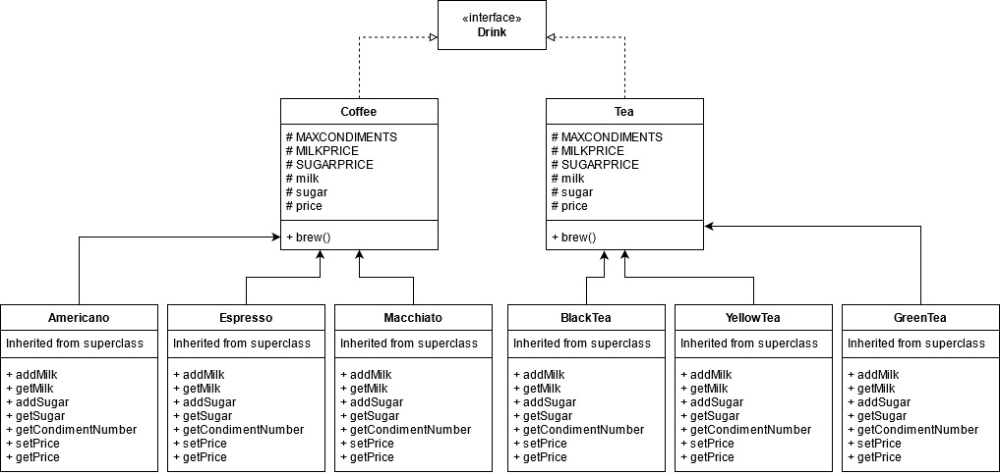

# CS 665 Assignment 6

### Marcus Andrew Acord-Serventi

### Summary

I chose to refactor assignment 1. For assignment 1 I originally submitted 2 sole classes - a test class and a drink class. It was crude and had a lot of issues, the worst of which was VERY tight coupling. I reimplemented assignment 1 for assignment 6. I managed to remove a LOT of the coupling by implementing template method, removed some unused code (speculative generality dispensable), and removing a switch statement (object orientation abuser).

### Refactoring details

1. Lessened coupling. Implemented template method to remove some of the heavy coupling with my classes. This required making a Drink interface, then a coffee and tea abstract classes, then lastly I implemented subclasses for specific types of coffee and tea. 

2. I had some speculative generality that I removed and made the code simpler and easier to work with. For example, previously, each drink required a name, so Drink mydrink = new Drink("mydrink1"). I removed some of this unnecessary work so that now you can simply do Drink mydrink = new Macchiato(). No name is required and drinks are now easier to create.

3. The last change I made to refactor was to remove a hard object-orientation abuser of a switch statement. I had what was essentially a switch statement. If a drink had a certain name, it was classified as that type of drink. I removed this switch statement by creating specific subclasses, which refactored my code by removing an object orientation abuser.

### UML

