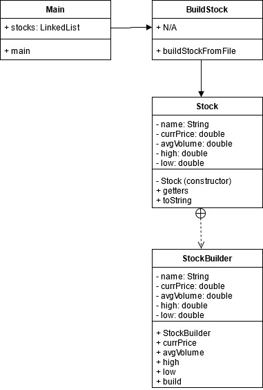

# CS 665 Coding Project

### Marcus Andrew Acord-Serventi

### Summary

For the project I wanted to do something with stocks. I normally trade stocks and buy and sell regularly. I figured I could use one of the design patterns to create a stock object, then display relative data on a stock to the user from a .csv file. I chose to go with the builder pattern (from Java Design patterns: "Separate the construction of a complex object from its representation so that the same construction process can create different representations."); stocks can have a ton of different stats to look at, so builder made sense.

### Implementation details

I grabbed my .csv file from Yahoo financials for my stocks, read from the file, build a stock object, and then display a few stats to the user. Using the builder pattern allowed us to build a stock object, with a long constructor, that was easy to understand which variables were being built. If, for some reason, some data was not available, I can remove that variable from being built, without worrying about multiple constructors or the program crashing.

The main file is how we run the program. It contains some the UI to define the name of the stock (the name was not available in the file!) and the file to be read's name. It calls the buildStock class to actually build the stock.

The BuildStock class basically contains the method to read from the file and call the stockBuilder to build a stock object. I would consider this a mini-facade, since it hides a lot of the complexity in the main class to actually build the stock.

Lastly, the Stock class is a Stock object. It contains the static StockBuilder class to actually build a flexible stock object. If a variable is not available for a typical constructor, it doesn't need to be added in order to be built. It only requires the stock's name to be built.

### UML

### Assignment Questions

1. Design Goals - I want to build a stock object, then return some relevant stats on the stock to the user. I want to build actual stock stats using a file grabbed from the internet. And I wanted the flexibility so that if data was wrong, or missing, I didn't have to build the full stock object. I also wanted to avoid the problem of telescoping constructors, since stock's data can grow complex.

2. Simplicity - The main code is very simple. The complex code comes from reading from the file and grabbing the relevant data. The builder pattern and how to add new parts is VERY easy to understand (builder actually increases simplicity here, although it makes code longer).

3. Flexibility - New stats would be somewhat difficult to add. We could add them in the Stock class, but we need to add them to both the base class itself and in the builder. The nice thing is that if we add new attributes or remove attributes, when we actually build the object, we have the flexibility to omit or add those features via the builder (Stock stock = new StockBuilder.currPrice.build or Stock stock = new Stockbuilder.build both work easily)

4. Duplicated Code - Unfortunuately, one of the downsides to using builder is that some of your code is duplicated when creating the builder class.
